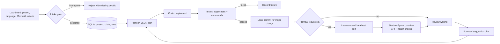

# Super-agent harness

A local, user-controlled starting point for turning a specification into tested,
committed code and an optional local preview. It never pushes and never creates a
pull request. You retain the only permission to push your branch.



## Start here

Install the harness and then open the dashboard with no arguments:

```powershell
.\.venv\Scripts\python.exe -m pip install -e ".[dev]"
super-agent
```

On first launch, the keyboard-driven dashboard asks you to configure the one
global localhost preview-port pool the harness may use. The range must contain
at least five ports. Later, use **9 Settings** to view its live inventory and
event history or change the range (after stopping previews outside the new
range). The dashboard also lets you create a project, choose its primary
language (`Go`, `C`, `C++`, `Rust`, `TypeScript`, `Python`, or `Java`), enter a
goal, GitHub clone URL, Mermaid design, and acceptance criteria. It also lists
projects, revision chats, local previews, leased ports, and recent revisions.

JSON is now only an import/export format. Import it once, then run the persisted
project by its full ID, unique ID prefix, or exact name:

```powershell
super-agent validate .\example-project.profile.json
super-agent import .\example-project.profile.json
super-agent run PROJECT-ID
super-agent run PROJECT-ID --preview
super-agent run PROJECT-ID --deploy
super-agent run PROJECT-ID --chat-id YOUR-CHAT-ID --preview
super-agent export PROJECT-ID
```

The import command prints the created project ID. The dashboard lists IDs and lets
you run revisions directly from SQLite. Exported backups use
`project-name.project-id.profile.json`; the supplied
[`example-project.profile.json`](example-project.profile.json) is a starting import
template. Replace its repository, model commands, Mermaid diagram, criteria,
testing commands, and preview command before importing it.

## Delivery boundaries

- Intake requires a concrete goal, GitHub clone URL, Mermaid architecture,
  observable criteria, and a selected project language.
- Every model response is validated JSON. A malformed or `decision: "no"` result
  fails closed; the prompt, requested schema, and valid response are retained in
  local SQLite.
- Each successful major change can create a **local** commit when
  `commit.enabled` is true. The harness has no push command, no GitHub CLI code,
  and no PR submitter. Each run clone also gets a `pre-push` hook that rejects
  pushes unless its owner explicitly sets `SUPER_AGENT_ALLOW_PUSH=1` in their own
  terminal. Push only after you inspect the branch yourself.
- Test commands are argv arrays rather than shell strings. Failing tests stop
  commits, deployment, and preview creation.
- `sandbox.mode: "process"` is a path/timeout guardrail, not a security boundary.
  Use Docker mode where you need isolation.

## Persistent project control plane

The default database is `runs/super-agent.sqlite3` and is intentionally ignored
by Git. It stores:

- Project specifications, selected language, and execution profile;
- run/revision state and local commit SHA;
- model prompts, JSON schemas, and structured outputs;
- focused revision chats and their messages;
- the global preview-port policy, port availability inventory, taken/freed
  event history, port leases, and preview process records; and
- configured deployment command results.

`memory.json` remains a durable per-run transcript passed from planner to coder
to tester. SQLite persists history across runs, but only an explicitly selected
revision chat is injected into a new model run. This keeps unrelated old work out
of the model context.

After a JSON profile has been imported, SQLite is the source of truth for the
project specification and model/test/deployment settings. `super-agent run` does
not read a JSON configuration file. JSON remains useful for bootstrapping a new
project, moving a profile between local databases, reviewing a profile in source
control, or making a backup.

Every dashboard suggestion starts a separate revision chat. You can add review
messages to that chat and apply it with `--chat-id`. After the seventeenth
conversation since the last compaction, the next revision automatically uses the
planner to write a durable summary before planning or coding resumes. The stored
summary plus the most recent sixteen messages become the next revision context.

## Local preview and port safety

Preview deployment is intentionally explicit. Configure `preview.enabled: true`
and one argv `preview.command` containing `{port}`. During first-run onboarding,
the server owner selects the global preview range; project profiles cannot widen
or replace it. The harness probes every port in that pool, persists its latest
`available`, `occupied`, or `leased` state, and appends an event whenever an
observed port becomes taken or free. It then leases a free port, starts the
command with `SUPER_AGENT_PORT`, waits for that port to open, and runs optional
URL and argv health checks.

For example, a Python project can use:

```json
"preview": {
  "enabled": true,
  "command": ["python", "-m", "http.server", "{port}"],
  "health_check_url": "http://127.0.0.1:{port}/"
}
```

Older imported profiles may still contain `port_start` and `port_end`; they are
accepted for compatibility but ignored. Change the global pool from dashboard
**Settings**, not in an individual project profile.

Run it with `super-agent run PROJECT-ID --preview`. The result includes
the local preview URL and enters `review_waiting`. Review it, create a focused
suggestion in the dashboard, then run that chat as the next revision. Stop the
preview from dashboard action 6; that terminates the tracked process and releases
its lease. The preview command is user-provided—the harness does not guess how
your application should start.

The older general `deployment` stage remains available for user-configured
current-host commands via `--deploy`; arbitrary deployment commands cannot be
port-inspected, so use the preview stage whenever you need safe managed API port
allocation.

## Providers

The planner is text/read-only; coder and tester must be workspace-capable CLIs or
explicit unified-diff (`patch`) agents. Codex uses native `--output-schema`,
Ollama uses `/api/chat` schema formatting, and Claude/custom command output is
validated by the harness. Authenticate provider CLIs however you normally do;
provider credentials are never stored in the harness database.

## Edit role prompts through `.env`

Copy [.env.example](.env.example) to `.env`. The supplied root-level
[`prompts`](prompts) directory contains the editable templates for `planner`,
`chat_summary`, `coder`, `tester`, and the shared `structured_output` wrapper.
The harness reads `.env` on startup and uses:

```dotenv
SUPER_AGENT_PROMPTS_DIRECTORY=prompts
# Or override only one role:
SUPER_AGENT_CODER_PROMPT_FILE=prompts/coder.txt
```

Paths are relative to `.env`; absolute paths also work. Templates use Python
`$variable` substitutions such as `$goal`, `$plan`, and `$memory_context`. Use
`$$` for a literal dollar sign. The exact rendered prompt and requested JSON
schema remain in the local SQLite audit trail. Do not put credentials or secrets
inside prompt templates. `.env` is excluded from Git and the Docker build context;
Compose no longer injects it into the container.

The `structured_output` template is intentionally both a strict instruction and a
portable fallback. Codex receives the same schema through native `--output-schema`
and Ollama receives it through native `format`; the template reinforces the contract
and covers Claude/custom CLIs, whose text still needs parsing and local validation.
It is not merely asking a model to “be structured”: after every response the harness
validates the returned object against that same schema and retries or fails closed.
