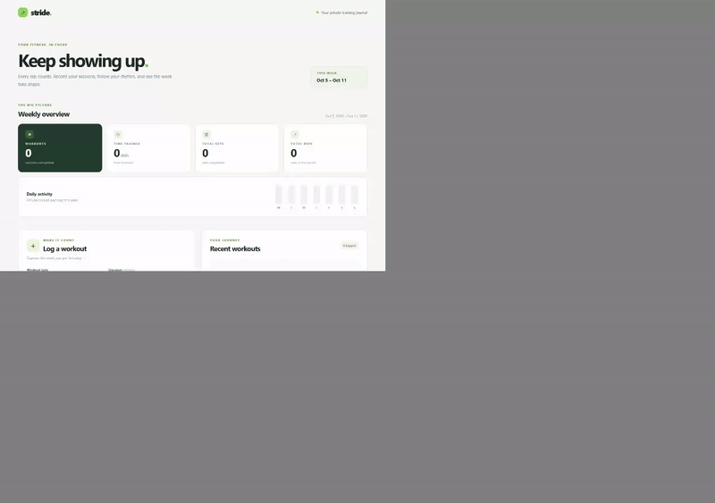

# Super-agent

A small personal app builder. Give it an idea; Codex writes a browser frontend,
a Python backend, SQLite persistence, and tests in a local Git project.
Super-agent then runs the tests, checks JavaScript syntax, starts the app on a
temporary local port, checks the page and script over HTTP, and commits only a
verified result. It retries one failed verification without asking you to
manage a planner, model routes, or quotas.

This is useful for **personal projects on a private server or VPS**. Deployment
commands run on the machine where Super-agent is installed. Nginx installation
is explicit and reversible. Super-agent does not create a VPS, configure TLS,
or connect to a remote host for you.
Generated apps have no login by default, so keep them behind a private network
or add authentication before exposing them publicly.

## Quick start

Install Python 3.10+, Git, Node.js, and the [Codex CLI](https://github.com/openai/codex),
then sign in to Codex. From this repository:

```powershell
py -m venv .venv
.\.venv\Scripts\python.exe -m pip install -e ".[dev]"
.\.venv\Scripts\super-agent.exe new "a private notes app"
```

On Linux, use `python3 -m venv .venv`, `.venv/bin/python`, and
`.venv/bin/super-agent` instead. The finished app is in
`projects/a-private-notes-app`. Its own README explains how to run it.
The [fitness app example](examples/fitness-app) is a complete app generated by
this workflow, with frontend, API, SQLite storage, and integration tests.

Add any amount of detail when you want to; every option below is optional:

```sh
super-agent new 'a workout journal' \
  --detail 'Log exercises, sets, reps, and notes' \
  --details-file longer-brief.txt \
  --flowchart-file flowchart.mmd \
  --criterion 'A workout remains after restarting the app'
```

```sh
super-agent projects
super-agent status a-private-notes-app
super-agent change a-private-notes-app 'Add search by keyword'
```

If Codex stops after writing files, Super-agent still checks the files and can
keep a verified app. If the checks fail twice, it records the failure in the
project's `.super-agent/latest.json` and leaves the files available to inspect.
Each project is local and has its own Git history.

## Private server or VPS deployment

Install the generated app as a service on your server first. Save its restart
and health check as argv arrays in `deploy.json` (no shell interpolation):

```json
{
  "commands": [["systemctl", "restart", "my-app.service"]],
  "health_check_commands": [["curl", "--fail", "http://127.0.0.1:8000/"]]
}
```

```sh
super-agent server configure a-private-notes-app --file deploy.json --auto
super-agent server run a-private-notes-app
```

`server run` rechecks the app before deployment, then runs the health checks.
`--auto` runs the same deployment after successful future `change` commands.
Omit `--auto` for manual deployment. Use a dedicated OS user with only the
permissions those commands require; keep credentials out of `deploy.json`.

For Nginx, prepare and review a site file. The first command is a dry run:

```sh
super-agent server nginx --file site.conf \
  --root /etc/nginx/conf.d \
  --target /etc/nginx/conf.d/my-app.conf
```

Add `--apply` to write it, run `nginx -t`, and reload Nginx. Validation or
reload failure restores the previous file. Your Nginx installation must include
the chosen target directory, and the operator needs permission to write it.

## First-use screen recording

I ran this command, then recorded the generated fitness app in a real browser:

```sh
super-agent new 'a personal fitness tracker' \
  --detail 'Log workouts with exercises, sets, reps, and duration; show recent workouts and a weekly summary.' \
  --criterion 'Workouts are saved in SQLite and remain after restarting the app.' \
  --output projects/fitness-working
```

The demo logs a workout, shows the weekly totals and recent workout, then
reloads the page to confirm the data persisted. The recording shows the real
browser actions; the CLI run was checked separately.



[Download the MP4 recording](docs/demo.mp4)

## Run the repository checks

```sh
python -m pip install -e '.[dev]'
python -m ruff check src tests
python -m pytest -q -p no:cacheprovider
```

GitHub Actions runs these checks and verifies the generated fitness app on
Windows and Linux. CI uses a fake Codex writer for builder tests and local
deployment fixtures; it does not access a model subscription or a real VPS.
The demo above came from an actual Codex build and browser walkthrough.
